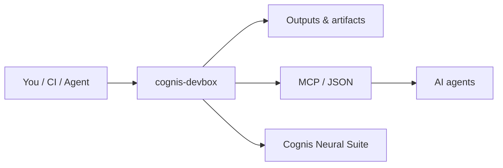

<div align="center">

# cognis-devbox

### A custom dev OS image with *every* language + cloud + AI tool preinstalled — build once (Packer/KVM), boot anywhere.

[](LICENSE)   [](https://github.com/cognis-digital/cognis-neural-suite)

</div>

## What is this?

cognis-devbox is a ready-made developer workstation image that comes with every major programming language, cloud command-line tool, and AI framework already installed — so you never have to spend hours setting up a new machine from scratch. You build the image once using the included scripts, then boot it on any Linux server, virtual machine, or cloud instance and start coding immediately. It is aimed at developers, DevOps engineers, and AI practitioners who want a consistent, reproducible environment without the setup hassle. Whether you spin it up on your laptop, a rented cloud VM, or a CI pipeline, you always get the same fully-equipped workspace.

## Getting started

Pick the method that matches your setup:

**Option A — KVM/QEMU image (recommended for bare-metal Linux)**

```bash
# Requires: packer, qemu-kvm
git clone https://github.com/cognis-digital/cognis-devbox.git
cd cognis-devbox
packer init . && packer build .   # produces output-devbox/cognis-devbox.qcow2
bash scripts/run-qemu.sh
```

**Option B — Vagrant (Linux/macOS/Windows with VirtualBox or libvirt)**

```bash
git clone https://github.com/cognis-digital/cognis-devbox.git
cd cognis-devbox
vagrant up
```

**Option C — Provision an existing Ubuntu VM or cloud instance**

```bash
git clone https://github.com/cognis-digital/cognis-devbox.git
cd cognis-devbox
bash provision/install-all.sh
# Or pass cloud-init/user-data.yaml to your cloud provider at launch
```

See **[MANIFEST.md](MANIFEST.md)** for the full list of preinstalled tools.

Just want the installer menu instead of a whole image? See **[omni-install](https://github.com/cognis-digital/omni-install)**.

## How it fits



**Explore the suite →** [🗂️ all tools](https://github.com/cognis-digital/cognis-neural-suite) · [⭐ awesome-cognis](https://github.com/cognis-digital/awesome-cognis) · [🔗 cognis-sources](https://github.com/cognis-digital/cognis-sources)

<a name="verification"></a>
## Verification


Every push is verified end-to-end. Latest audit (2026-06-13):

```text
tests        : 0 passed, 0 failed, 0 errored
compile      : all modules parse
cli          : n/a
package      : n/a
```

<details><summary>CLI surface (<code>--help</code>)</summary>

```text
(see --help)
```
</details>

Full machine-readable results: [`AUDIT.md`](AUDIT.md) · regenerate with `python -m cognis-devbox --help` + `pytest -q`.

<div align="right"><a href="#top">↑ back to top</a></div>


## License
COCL v1.0 — see [LICENSE](LICENSE).

<!-- cognis:domains:start -->
## Domains

**Primary domain:** Cloud & DevTools  ·  **JTF MERIDIAN division:** ATHENA-PRIME · COGNI-2

**Topics:** `cognis` `devtools` `cloud` `developer-tools`

Part of the **Cognis Neural Suite** — 300+ source-available tools organized across 12 domains under the JTF MERIDIAN command structure. See the [suite on GitHub](https://github.com/cognis-digital) and [jtf-meridian](https://github.com/cognis-digital/jtf-meridian) for how the pieces fit together.
<!-- cognis:domains:end -->
