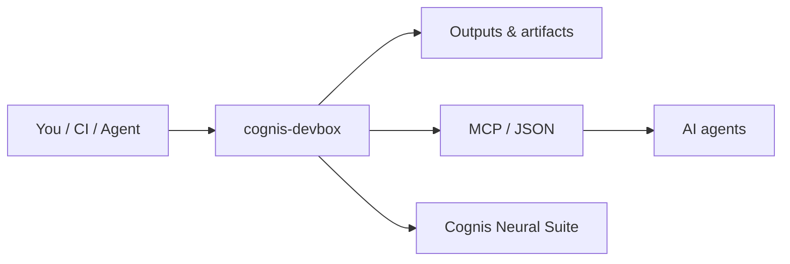

<div align="center">

# cognis-devbox

### A custom dev OS image with *every* language + cloud + AI tool preinstalled — build once (Packer/KVM), boot anywhere.

[](LICENSE)   [](https://github.com/cognis-digital/cognis-neural-suite)

</div>

Stop yak-shaving a new machine. `cognis-devbox` bakes a complete polyglot dev environment into a
reusable image — see **[MANIFEST.md](MANIFEST.md)** for the full toolset.

```bash
# Option A — KVM/QEMU image (qcow2)
packer init . && packer build .          # -> output-devbox/cognis-devbox.qcow2
bash scripts/run-qemu.sh

# Option B — Vagrant (libvirt or VirtualBox)
vagrant up

# Option C — provision an existing box / cloud VM
bash provision/install-all.sh            # or use cloud-init/user-data.yaml
```

Just want the installer menu instead of a whole image? See **[omni-install](https://github.com/cognis-digital/omni-install)**.

## How it fits



**Explore the suite →** [🗂️ all tools](https://github.com/cognis-digital/cognis-neural-suite) · [⭐ awesome-cognis](https://github.com/cognis-digital/awesome-cognis) · [🔗 cognis-sources](https://github.com/cognis-digital/cognis-sources)

<a name="verification"></a>
## Verification


Every push is verified end-to-end. Latest audit (2026-06-13):

```text
tests        : 0 passed, 0 failed, 0 errored
compile      : all modules parse
cli          : n/a
package      : n/a
```

<details><summary>CLI surface (<code>--help</code>)</summary>

```text
(see --help)
```
</details>

Full machine-readable results: [`AUDIT.md`](AUDIT.md) · regenerate with `python -m cognis-devbox --help` + `pytest -q`.

<div align="right"><a href="#top">↑ back to top</a></div>


## License
COCL v1.0 — see [LICENSE](LICENSE).
